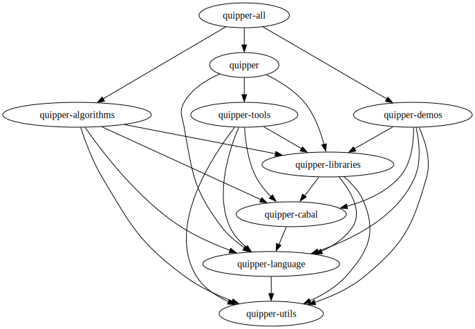

# Quipper

This is a version of [Quipper](https://www.mathstat.dal.ca/~selinger/quipper/) updated to work with current versions of GHC (tested with 9.6.2) and dependencies.

It is updated to work with Cabal new-style builds, so, assuming `cabal-install` 3.0 or later, you can build any of the packages by running `cabal build <package>` in this directory, or run any of the included programs with `cabal run <program>`.
(This does not work for `quipper`, `quipperi` or `quipperdoc`, which require `quipper-pp` to be installed in the PATH.)

## Usage

To use Quipper in a Cabal package, add the individual libraries you need as dependencies (likely `quipper-utils`, `quipper-language` and `quipper-libraries`).
`quipper-cabal` can be used to run the preprocessor during the build.
See `quipper-demos` for an example of how to configure a package.

To use this version of Quipper, the package should either be placed in this directory, or have a `cabal.project` file pointing to these packages.

Alternatively, Quipper can be installed globally.
The `quipper` and `quipper-all` meta-packages are no longer useful with new-style installation.
The previously recommended `cabal v1-install quipper` (which is still available) is roughly equivalent to:
```
cabal install --lib quipper-utils quipper-language quipper-libraries
cabal install quipper-language quipper-tools
```
The `quipper-all` package would install the above, in addition to `quipper-algorithms` (library and executables) and `quipper-demos` (executables).

## Packages

The following graph shows all the Quipper packages, with dependencies indicated.


